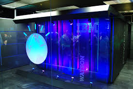

## Course Overview

This graduate-level MBA course examines the intersection of artificial intelligence, management strategy, and social innovation. Rather than focusing on technical implementation, the course approaches AI as a strategic and organisational phenomenon - analysing adoption decisions, value creation, governance, and social consequence through established management frameworks.

::: {.incremental}
- Students will engage with seminal theoretical texts alongside contemporary case materials.
- Develop the analytical vocabulary to evaluate AI-driven change across healthcare, data markets, infrastructure, public policy, and the emerging silver economy.
- **Format:** 6 weekly sessions · 3 hours each · 18 contact hours total
:::

---

## Week 1: AI Strategy in Healthcare

::: incremental
- **Keywords:** AI adoption · Strategic investment · Build vs buy · Vendor risk · ROI framing · IBM Watson lesson
- **Management Focus:** AI adoption as a strategic decision.
:::

### The IBM Watson Health Case

::: {.incremental}
- Initial acquisition investment exceeded **$4 billion**.
- Acquired companies like **Truven Health Analytics** and **Merge Healthcare**.
- Partnerships with over **200** hospitals globally.
- The unit was sold in 2022 for approximately **$1 billion**.
- A **75% loss** in acquisition value alone.
:::

### Failed Pilots

::: {.incremental}
- MD Anderson’s **$62 million** oncology project.
- Evaluating the risks of strategic lock-in.
- How to frame AI investment cases for boards and executive committees.
:::

### Theories & Seminal Readings

::: {.incremental}
- **Disruptive Innovation** (Bower & Christensen, 1995)
- **Technology Acceptance Model (TAM)** (Davis, 1989)
- **Resource-Based View (RBV)** (Barney, 1991)
:::

---

## Week 2: AI in the Medical Sector

::: {.incremental}
- **Keywords:** Market entry · Regulatory strategy · Partnership models · Liability management · Value chain disruption · Innovation pipeline
- **Management Focus:** Navigating institutional complexity in a regulated market.
:::

### FDA Authorization

::: {.incremental}
- As of mid-2024, the FDA has authorized over **950** AI/ML-enabled medical devices.
- Radiology accounts for **80%** of clearances.
:::

### Global Healthcare AI Market

::: {.incremental}
- Projected to grow from **$20 billion** in 2024...
- ...to over **$600 billion** by 2033.
:::

### Theories & Seminal Readings

::: {.incremental}
- **Porter's Value Chain** (Porter & Millar, 1985)
- **Institutional Theory** (DiMaggio & Powell, 1983)
- **Transaction Cost Economics (TCE)** (Williamson, 1981)
:::

---

## Week 3: AI & Data as Strategic Assets

::: {.incremental}
- **Keywords:** Data governance · Competitive moat · Platform strategy · Monetisation · Risk & compliance · Organisational readiness
- **Management Focus:** How AI amplifies the value of proprietary data.
:::

### The Value of Data

::: {.incremental}
- AI is projected to contribute up to **$15.7 trillion** to the global economy by 2030.
- **60%** of potential value remains trapped in ungoverned data silos.
:::

### Theories & Seminal Readings

::: {.incremental}
- **Dynamic Capabilities** (Teece, Pisano, & Shuen, 1997)
- **Platform Economics (Two-Sided Markets)** (Rochet & Tirole, 2003)
- **Information Asymmetry** (Akerlof, 1970)
:::

---

## Week 4: AI & IoT Operations

::: {.incremental}
- **Keywords:** Operational efficiency · Smart infrastructure · Ecosystem management · Scalability · Capital allocation · Supply chain AI
- **Management Focus:** AI-IoT integration through an operational and ecosystem lens.
:::

### The IoT Landscape

::: {.incremental}
- **30 to 40 billion** connected devices by 2030.
- Potential economic value estimated between **$5.5 trillion** and **$12.6 trillion**.
- IoT could add **$14 trillion** to the global economy via industrial efficiency.
:::

### Theories & Seminal Readings

::: {.incremental}
- **Ecosystem Theory** (Moore, 1993)
- **Diffusion of Innovations** (Rogers, 2004)
- **Lean Operations** (Womack & Jones, 1994)
:::

---

## Week 5: AI for Social Impact

::: {.incremental}
- **Keywords:** Stakeholder mapping · Public-private partnership · ESG integration · Social ROI · Appropriate technology · Change management · Inequality
- **Management Focus:** Shifting the unit of analysis from the firm to society.
:::

### Public Sector AI

::: {.incremental}
- Public sector AI spending projected to reach **$85 billion** by 2030.
- Nations like Saudi Arabia dedicating **$40 billion** infrastructure funds to AI-led transformation.
- AI-driven risk mitigation can reduce unintended societal consequences by up to **40%**.
:::

### Theories & Seminal Readings

::: {.incremental}
- **Stakeholder Theory** (Freeman & Reed, 1983)
- **Appropriate Technology** (Schumacher, 1972)
- **Triple Bottom Line** (Elkington, 1998)
:::

---

## Week 6: Smart Silver Economy Business Model

::: {.incremental}
- **Keywords:** Market sizing · Business model canvas · Value proposition · Customer segmentation · Revenue streams · Social enterprise · Longevity economy
- **Management Focus:** Integrating the course's themes into a capstone business model exercise.
:::

### The Longevity Economy

::: {.incremental}
- Projected to reach **$27 trillion** by 2030.
- The 50-plus cohort is expected to account for **54%** of all global consumption (**$52 trillion**).
- This segment controls **34%** of global wealth.
:::

### Theories & Seminal Readings

::: {.incremental}
- **Business Model Canvas** (Osterwalder, Pigneur, & Tucci, 2005)
- **Blue Ocean Strategy** (Kim & Mauborgne, 2004)
- **Base of the Pyramid (BoP)** (Prahalad & Hammond, 2002)
:::

---

## Assessment

| Component | Weight |
|---|---|
| Weekly response papers | 30% |
| Case discussion participation | 20% |
| Mid-course stakeholder analysis | 20% |
| Final business model presentation | 30% |

---

## A Note on Theoretical Pairing

Each week pairs a primary strategy theory with two supporting frameworks.

::: {.incremental}
- **Week 1:** Christensen's disruption logic vs. Davis's TAM.
- **Week 5:** Freeman's stakeholder model vs. Schumacher's appropriate technology thesis.
:::

These tensions are not problems to resolve - they are the analytical work of the course.
